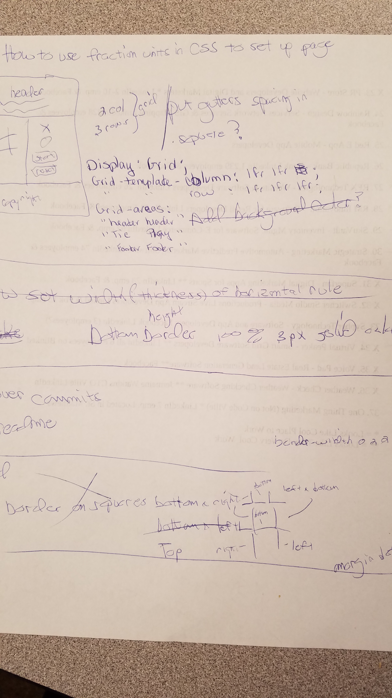

# tictactoe
General Assembly Tic Tac Toe Project

1. As a user I should be able to have directions on how to play the game.
2. As a user I should be able to start a new game.
3. As a user I should be able to restart a game.
4. As a user I should be able to get notified of who won the game.
5. As a user I should be able to get notified of a draw, a game no one won.

The technologies used in creating this game were HTML5, CSS3 and JavaScript. I got the font from Google Fonts. 

The approach I took to developing the game was as follows: 
1. I drew a very basic wireframe of what I wanted the site to look like.
2. I wrote out in very general pseudocode what I wanted the game to do, such as show the X's and O's and have the winner declared or if there is a draw in the game. 
3. I further refined the pseudocode to make it more specific as to what the game should do.
4. I created the HTML to make the form of the page and then wrote the CSS to style the HTML.
5. I wrote the JavaScript and worked several days on refactoring it. 
6. With extra time on Thursday, I started to re-design the game page.

Main Fetures:

1. The X's and O's are shown in the relevant clicked squares of the game grid. 
2. An alert box shows whether X or O won or if there is a draw.
3. There is a "New Game" button to clear all of the X's and O's from the grid.

